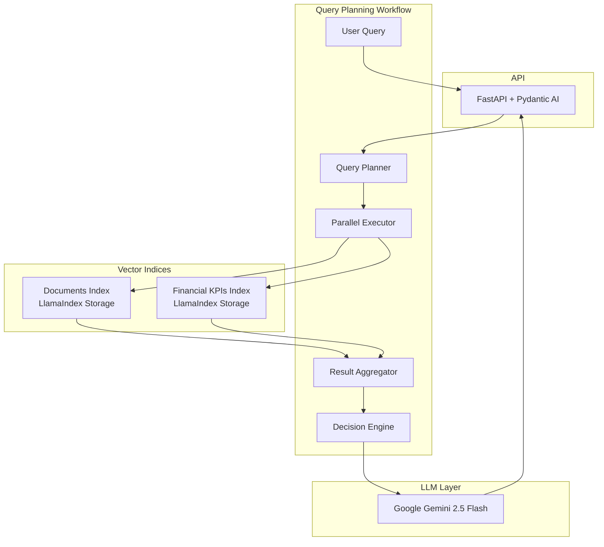

# 🚀 IntelliChat - Advanced Multi-Hop RAG Solution

**Built for Krisp Hackathon 2025** | September 12-14, 2025

<div align="center">
  
  
  
  
  
</div>

## 🏆 Executive Summary

IntelliChat is an AI-powered chat application that revolutionizes how users interact with large-scale knowledge bases. Built for the Krisp Hackathon 2025 challenge, our solution implements advanced multi-hop reasoning and intelligent query planning to process Alphabet's extensive financial documentation.

### 🎯 Key Achievements
- **Multi-Hop RAG Architecture**: Autonomous query decomposition and iterative reasoning
- **Intelligent Query Planning**: Breaks complex questions into parallel sub-queries
- **Dual Index System**: Separate indices for documents and financial KPIs
- **Production Ready**: Complete with API, frontend, and data ingestion pipeline

## 🏗️ Architecture Overview

### Multi-Hop RAG System with LlamaIndex


## 🌟 Core Features

### 1. **Advanced Multi-Hop RAG Pipeline**
Our LlamaIndex-based solution implements a sophisticated query planning workflow:
- **Autonomous Query Decomposition**: Breaks down complex questions into atomic sub-queries
- **Parallel Execution**: Executes up to 4 sub-queries simultaneously
- **Iterative Refinement**: Re-plans based on intermediate results if needed
- **Tool Routing**: Intelligently routes to specialized indices

```python
# Example: "How did Google Cloud perform compared to YouTube in Q3 2023?"
# System automatically generates:
# 1. Query earning_release_kpis: "Google Cloud revenue Q3 2023"
# 2. Query earning_release_kpis: "YouTube revenue Q3 2023"  
# 3. Query documents_tool: "Google Cloud operating metrics Q3 2023"
# 4. Synthesize and compare results
```

### 2. **Intelligent Features**
- **Semantic Chunking**: Context-aware document splitting using BAAI/bge-small-en embeddings
- **Tool Routing**: Automatically routes queries to appropriate indices
- **Structured Output**: Uses Gemini's structured prediction for reliable parsing
- **Parallel Processing**: Executes up to 4 sub-queries simultaneously

## 🚀 Quick Start

### Prerequisites
- Python 3.11+
- Node.js 18+ (for React frontend)
- Google API Key (for Gemini 2.5 Flash)

### Setting Up the Application

```bash
# 1. Clone the repository
cd hackathon-2025

# 2. Setup Python environment
cd app
python -m venv venv
source venv/bin/activate  # Windows: venv\Scripts\activate
pip install -r requirements.txt

# 3. Set your Google API key
export GOOGLE_API_KEY="your-google-api-key"

# 4. Build vector indices (run from project root)
cd ..
python scripts/ingest_docs.py

# 5. Run the application
cd app
python main.py

# 6. In a new terminal, start the React frontend
cd frontend
npm install
npm start

# Access the application:
# - API: http://localhost:8000
# - Frontend: http://localhost:3000
```

## 📊 Data Processing Pipeline

### Document Ingestion
```bash
# Convert PDFs to Markdown (if needed)
python -m scripts.parse_docs

# Build LlamaIndex vector indices
python -m scripts.ingest_docs.py
```

### Supported Document Types
- **Earnings Releases**: Quarterly financial results
- **Earnings Transcripts**: Conference call transcriptions  
- **Earnings Slides**: Presentation materials
- **Product Documentation**: Feature announcements
- **General Documents**: Company statements and reports

## 🔧 Configuration

### Query Planning Configuration
```python
# app/chatbot/chatbot_with_routing.py
workflow = QueryPlanningWorkflow(verbose=False, timeout=360)

# Parallel execution of sub-queries
@step(num_workers=4)  # Execute up to 4 queries in parallel

# Index configuration
documents_query_engine = documents_index.as_query_engine(similarity_top_k=10, llm=llm)
```

## 📈 Key Features & Capabilities

### Multi-Hop RAG System
- **Query Planning**: Automatic decomposition of complex queries
- **Parallel Execution**: Up to 4 concurrent sub-queries
- **Gemini 2.5 Flash**: Fast inference with structured output
- **Semantic Chunking**: Context-aware document splitting using BAAI/bge embeddings
- **Persistent Storage**: LlamaIndex vector indices stored locally

## 🧪 Testing & Examples

### Test the Multi-Hop System
```python
# Run the example query
cd app/chatbot
python chatbot_with_routing.py
```

### Test the API
```bash
# Query the chatbot
curl -X POST http://localhost:8000/ \
  -H "Content-Type: application/json" \
  -d '{"question": "What was Google Cloud revenue in Q2 2025?"}'
```

## 🚀 Future Enhancements

### Near-term Improvements
1. **GraphRAG Integration**: Entity relationship mapping for deeper insights
2. **Voice Interface**: Audio query support
3. **Real-time Updates**: Live document streaming
4. **Fine-tuned Embeddings**: Domain-specific embeddings for financial data
5. **Advanced Caching**: Query result caching for improved performance

### Advanced Features
1. **Agentic Workflows**: Autonomous research agents for complex analysis
2. **Multi-modal Support**: Chart and graph analysis from earnings slides
3. **Predictive Queries**: Anticipate follow-up questions
4. **Collaborative Sessions**: Multi-user query sessions
5. **Export & Reporting**: Generate executive summaries and reports

### Infrastructure Scaling
1. **Distributed Computing**: Scale query processing across multiple nodes
2. **Vector DB Migration**: Move to production vector databases (Pinecone, Weaviate)
3. **GPU Acceleration**: Speed up embedding generation
4. **Streaming Ingestion**: Real-time document processing
5. **Edge Deployment**: Run models locally for sensitive data

## 📚 Project Structure

```
hackathon-2025/
├── app/                    # Main application
│   ├── chatbot/           # Multi-hop RAG workflow
│   │   ├── chatbot_with_routing.py
│   │   └── models.py
│   ├── main.py            # FastAPI + Pydantic AI server
│   ├── prompt.py          # System prompts
│   └── storage/           # LlamaIndex vector indices
├── frontend/              # React UI
│   ├── src/
│   │   ├── components/    # React components
│   │   └── App.js
│   └── package.json
├── scripts/               # Data processing scripts
│   ├── ingest_docs.py    # Build vector indices
│   └── convert_pdfs_*.py # PDF to markdown conversion
├── data/                  # Knowledge base
│   ├── markdown/         # Processed documents
│   │   ├── earnings_release/
│   │   ├── earnings_transcript/
│   │   └── product_doc/
│   └── summaries/        # Financial summaries  
└── kb/                    # Original PDF files
```

## 🤝 Contributing

We welcome contributions! Key areas for improvement:
- Performance optimizations
- Additional document processors
- UI/UX enhancements
- Test coverage

## 📄 License

This project is licensed under the MIT License.

## 🙏 Acknowledgments

- **Krisp** for organizing this incredible hackathon
- **Google** for Gemini API and advanced AI capabilities
- **LlamaIndex** for the powerful RAG framework
- **Hugging Face** for BGE embeddings

---

<div align="center">
  <b>Built with ❤️ by Team EXPM</b><br>
  <i>Pushing the boundaries of GenAI at Krisp Hackathon 2025</i>
</div>